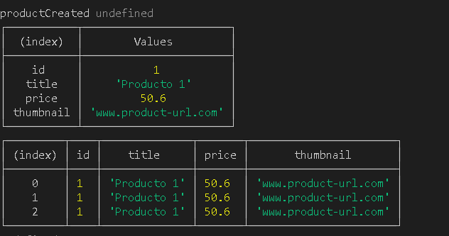
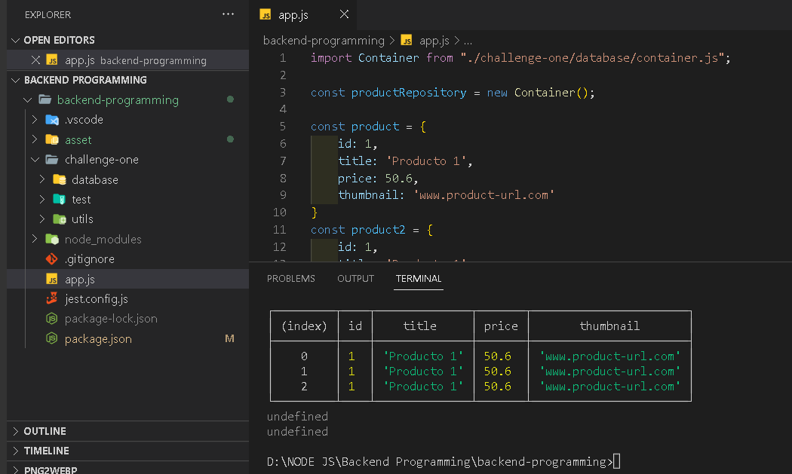

# Backend-Programming

## Challenge-one
## View code Example:

``` javascript
import Container from "./challenge-one/database/container.js";

const productRepository = new Container();

const product = {
    id: 1,
    title: 'Producto 1',
    price: 50.6,
    thumbnail: 'www.product-url.com'
}
const product2 = {
    id: 1,
    title: 'Producto 1',
    price: 50.6,
    thumbnail: 'www.product-url.com'
}

const product3 = {
    id: 1,
    title: 'Producto 1',
    price: 50.6,
    thumbnail: 'www.product-url.com'
}

const productCreated = productRepository.save(product)
productRepository.save(product2)
productRepository.save(product3)

console.log("productCreated", productCreated)


const productFound = productRepository.getById(1)
console.table(productFound)

const productsFound = productRepository.getAll()
console.table(productsFound)

const productDeleted = productRepository.deleteById(2)
console.table(productDeleted)


const productsDeleted = productRepository.deleteAll()
console.table(productsDeleted)


```
### Result Compile 1


### Code:


